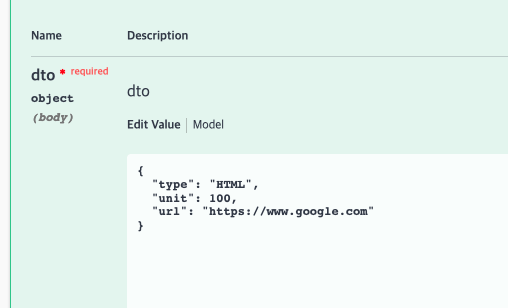

# 🚀 web-crawler

## 소개

- 입력된 주소를 크롤링하여 출력하는 어플리케이션입니다.
- URL을 입력하여 출력단위를 입력하여 제출하면, 크롤링한 결과를 영어,숫자를 교차하여 오름차순 출력합니다.
- 옵션을 통하여 HTML을 제거할 것인지 제거하지 않을 것인지 선택할 수 있습니다.

## 실행방법

- 별도의 설치는 필요하지 않고 ```./gradlew bootrun```으로 실행가능합니다.
- 실행후 http://localhost:8080/swagger-ui/index.html 으로 접속하여 테스트 가능합니다.
  

## 어떻게 구현했나요?

- 크롤링 라이브러리를 이용하여 검색하고자 하는 사이트의 HTML 정보를 받아옵니다.
- 검색 요건이 TEXT인지 HTML인지에 따라 검색된 결과에 허용되지 않는 값을 필터링 합니다.
- 텍스트를 정렬합니다.
- 출력 조건에 따라 출력 기준을 나눕니다.
